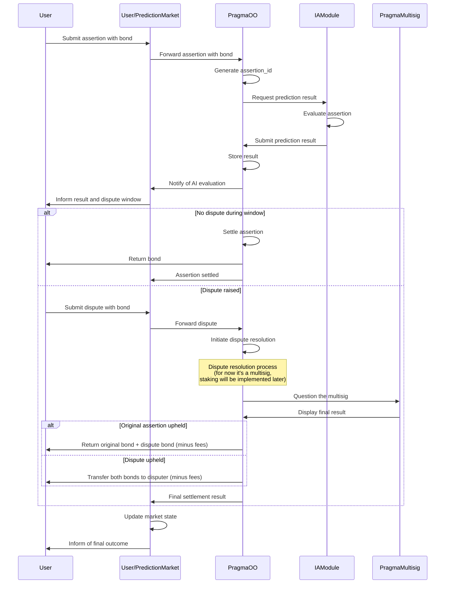
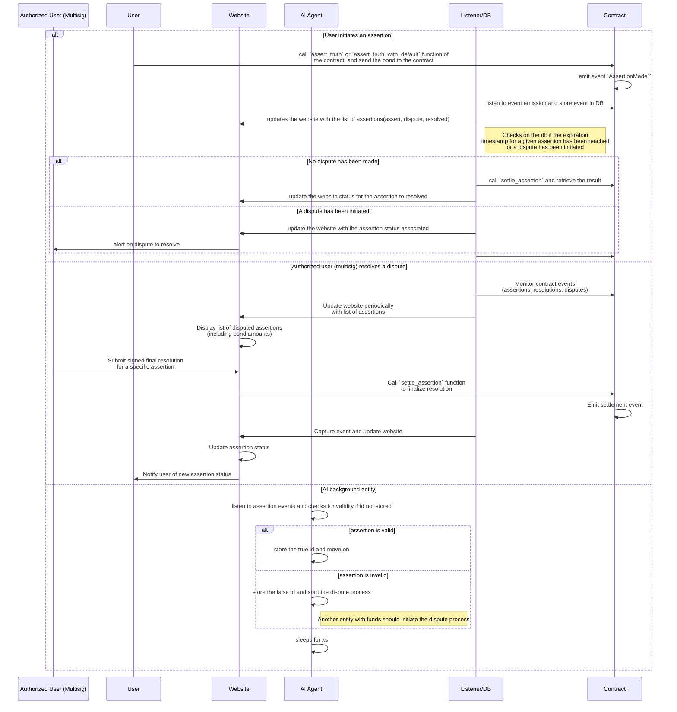

# Pragma Optimistic Oracle

> This repository details the first implementation of an optimistic oracle for prediction market. 

## Project presentation

 - In the first deployed version, we will be introducing a trusted optimistic oracle. A multisig set among a list of trusted actors will be responsible for the resolution. Everyone will be able to dispute, providing a bond. Full documentation available soon.

## General graph

